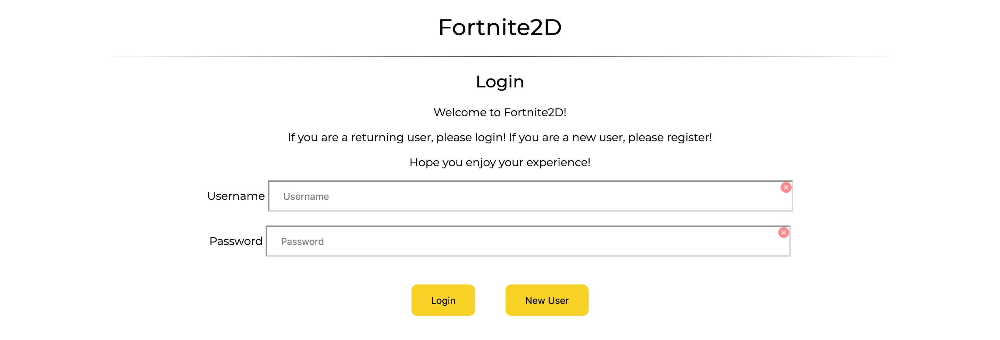
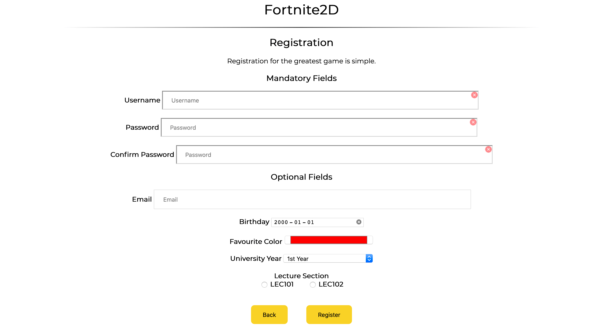
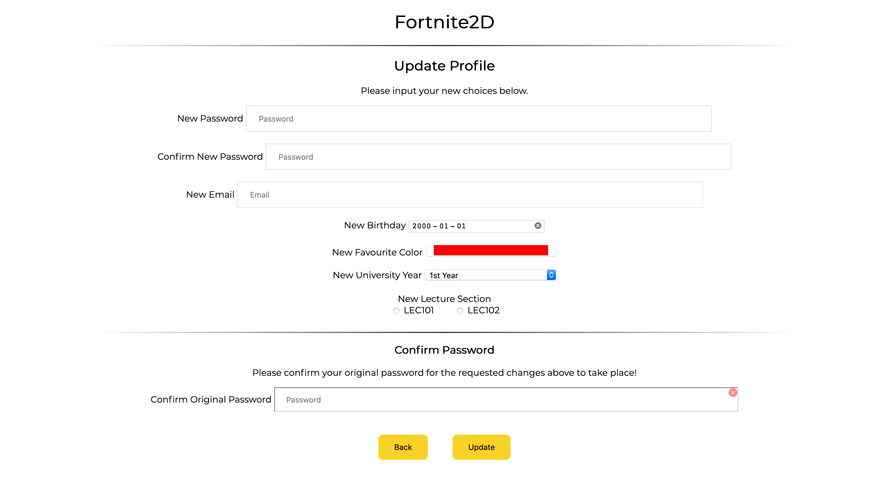
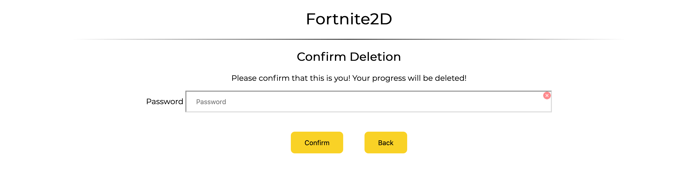
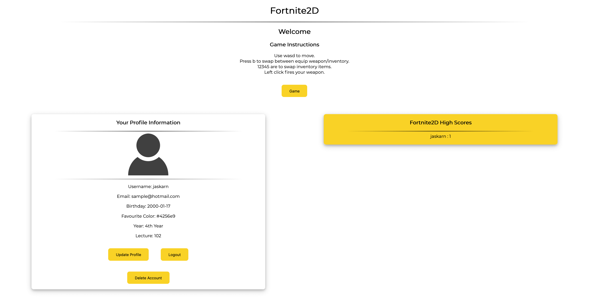

# fortnite-2d

A project done in pairs where we had to create a 2D version of Fortnite. This game is single player vs. multiple Machine AI.

* [Built With](#built-with)
* [Features](#features)
* [Interfaces](#interfaces)
* [Gameplay](#gameplay)

## Built With

* AJAX
* JQuery
* JSON
* Javascript
* Node Rest API
* Sqlite3

## Features

### General Features
* Use of canvas, see this lecture, and Canvas API at Mozilla
* Player starts with a weapon
* Keyboard movement wasd
* Mouse to move crosshair (change directional focus, point weapon)
* Amunition runs out
* Amunition can be picked up
* Amunition amount on display
* Health on display
* Can fire weapon, projectile on display
* Opponents can be killed
* Player can be killed
* Large world centered and scrolling around player
* Obstacles in the world
* Single type of AI, multiple AI opponents
* Player initially appears at simple location, for example, center of map
* Multiple projectiles fired from player weapon at the same time
* Projectile has limited range, impacts opponents and other obstacles in map

### Game Additional Features
* Obstacles can be destroyed
* Transporter Pods
* Interesting items, weapons can be picked up
* Different weapons have different characteristic
* Different actors have different velocities
* Movement through terrain at different velocities
* Opponents may drop items / powerups when defeated
* Wave-based system, where enemies respawn at every new wave, and progressively get stronger
* Game can be paused, resumed and restarted
* Mini-map on display
* Player can build
* Interesting items on display in inventory, can be used as in the linked example games

### Database Additional Features
* Included fields in registration and update for player email, birthday, favourite colour, university year and lecture section
* Password Hashing (bcrypt)
* Implemented sessionStorage to ensure you can leave page and come back (all pages except game if you leave the game page or have a game started you will be prompted because your data will be lost)
* JWT Tokens

## Interfaces

* [Login](#login)
* [Registration](#registration)
* [Update Profile](#update-profile)
* [Delete Account](#delete-account)
* [Main](#main)

### Login

### Registration

### Update Profile

### Delete Account

### Main

## Gameplay
**Please note actual gameplay is not as slow as below since below is a GIF of gameplay not a video!**

